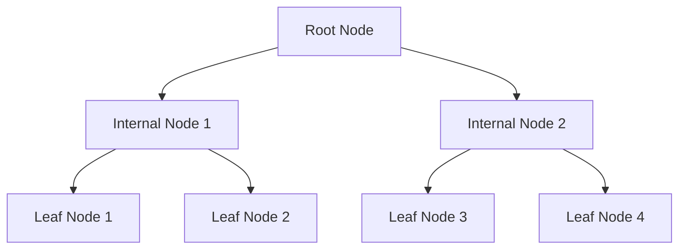
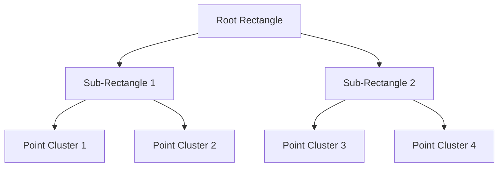
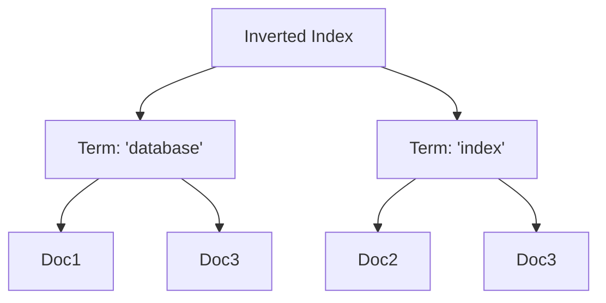

## Exploring Different Types of Database Index Implementations

Efficient database indexing is a cornerstone of high-performance systems. Indexes accelerate query performance, enabling quick data lookups without scanning entire datasets. Depending on the use case, database systems implement various index structures, each optimized for specific scenarios.

---

### **1. B-Tree Index**
- **Overview**: B-Trees are balanced search trees that store data in sorted order, making them ideal for range queries and point lookups.
- **Key Features**:
    - Balanced structure ensures logarithmic search time.
    - Nodes contain multiple keys and pointers, reducing I/O operations.
    - Supports ordered traversal for range queries.
- **Use Cases**:
    - Relational databases like MySQL, PostgreSQL (default index type).
    - Use cases with frequent updates and range queries.

**Diagram**:

---

### **2. Hash Index**
- **Overview**: Uses hash functions to map keys to buckets, ensuring O(1) average-time complexity for point lookups.
- **Key Features**:
    - Excellent for equality comparisons (`=` operator).
    - Does not support range queries.
    - Collisions managed via techniques like chaining or open addressing.
- **Use Cases**:
    - Applications requiring fast key-value lookups (e.g., caching layers).

---

### **3. Bitmap Index**
- **Overview**: Represents data using bitmaps, where each bit indicates the presence or absence of a value.
- **Key Features**:
    - Space-efficient for low-cardinality data (e.g., gender, status flags).
    - Ideal for analytical workloads with complex AND/OR/NOT queries.
- **Use Cases**:
    - Data warehouses, OLAP systems (e.g., Apache Hive, ClickHouse).

---

### **4. GiST (Generalized Search Tree)**
- **Overview**: A flexible index structure supporting various types of queries, including spatial and full-text searches.
- **Key Features**:
    - Extensible design for custom data types and operators.
    - Handles multi-dimensional data (e.g., geographic coordinates).
- **Use Cases**:
    - PostgreSQL for indexing spatial (PostGIS) and full-text data.

---

### **5. R-Tree Index**
- **Overview**: Specialized for spatial data, R-Trees organize objects into nested, hierarchically-arranged bounding rectangles.
- **Key Features**:
    - Efficient range and nearest-neighbor queries.
    - Optimized for spatial overlap searches.
- **Use Cases**:
    - GIS systems, location-based services.

**Diagram**:

---

### **6. LSM Tree (Log-Structured Merge Tree)**
- **Overview**: Optimized for high-throughput writes by buffering data in memory and merging it into sorted files on disk.
- **Key Features**:
    - Append-only write operations minimize disk I/O.
    - Background compaction reduces storage fragmentation.
    - Suitable for scenarios with high write throughput.
- **Use Cases**:
    - NoSQL databases (e.g., Cassandra, RocksDB, LevelDB).

---

### **7. Inverted Index**
- **Overview**: A mapping from content (e.g., words) to their locations in a dataset, enabling full-text search.
- **Key Features**:
    - Fast text-based lookups and keyword matching.
    - Often paired with ranking algorithms for relevance.
- **Use Cases**:
    - Search engines, full-text search in Elasticsearch, Apache Solr.

**Diagram**:

---

### **8. Trie (Prefix Tree)**
- **Overview**: A tree-based structure for efficient string storage and retrieval, with keys represented as paths from the root.
- **Key Features**:
    - Efficient for prefix and exact match queries.
    - Memory-intensive compared to other structures.
- **Use Cases**:
    - Auto-completion systems, DNS resolution.

---

### **Conclusion**
Each indexing technique balances trade-offs between read/write performance, storage overhead, and query capabilities. Selecting the right index type depends on the access patterns, data cardinality, and application requirements.

---

Let me know when you're ready to dive deep into **B-Trees (Post 2)** or **LSM Trees (Post 3)**!